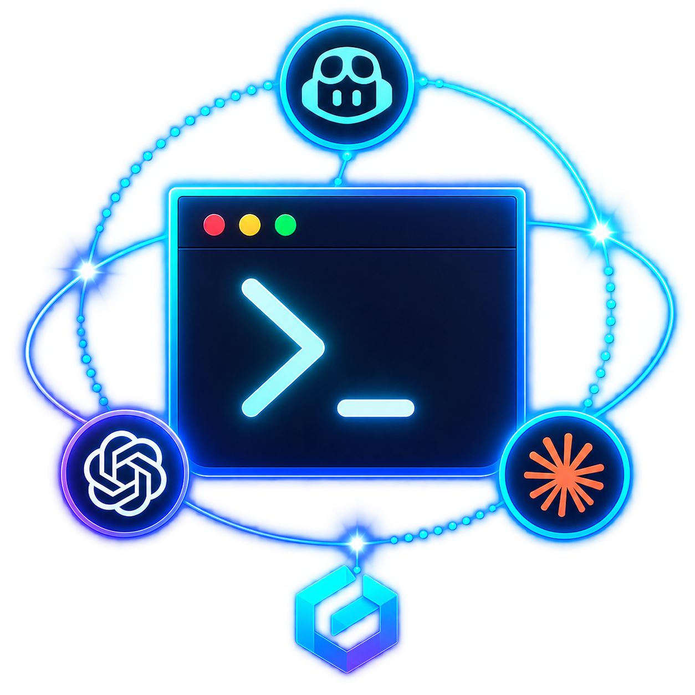

# AgenticCLIKit

[](https://github.com/messeb/AgenticCLIKit/actions/workflows/ci.yml)
[](https://messeb.github.io/AgenticCLIKit/documentation/agenticclikit)
[](https://swift.org)
[](https://developer.apple.com/macos/)
[](LICENSE)

<p align="center">
  
</p>

<p align="center">
  <a href="https://github.com/anthropics/claude-code"></a>
  <a href="https://github.com/openai/codex"></a>
  <a href="https://github.com/github/copilot-cli"></a>
  <a href="https://antigravity.google"></a>
  <a href="https://github.com/mistralai/mistral-vibe"></a>
</p>

<p align="center"><sub>Supported CLIs — each badge shows the release its adapter is verified against.</sub></p>

A Swift library for driving locally installed agentic CLIs — Claude Code, Codex, GitHub Copilot, Antigravity, and Mistral Vibe — from your own macOS app.

The CLIs bring their own auth, billing, sandboxing, and session persistence. This package brings the typed Swift layer: discovery, readiness, one-shot and multi-turn runs, streaming, session recovery, and typed errors — instead of five hand-rolled `Process` integrations that break on every CLI release.

```swift
let kit = AgenticCLIKit()

// Which agents can actually do work right now?
let report = await kit.healthReport()
print(report.formattedSummary())
// ✓ Claude Code 2.1.224 — sebastian@example.com via subscription
// ✓ Codex 0.147.0 — authenticated via subscription
// ✓ GitHub Copilot CLI 1.0.80 — octocat via oauth
// ✓ Antigravity 1.1.13 — authenticated via keychain
// ✓ Mistral Vibe 2.24.1 — authenticated via longLivedToken

let response = try await kit.run(
    "Summarise the uncommitted changes",
    using: .claudeCode,
    configuration: .readOnly(in: repositoryURL)
)

print(response.text)
print(response.usage?.costUSD ?? 0)

// Persist this and the conversation survives an app relaunch.
let session = response.session
```

---

## Read this first: App Sandbox

**A sandboxed app cannot use this package.** Spawning arbitrary user-installed binaries is not possible under App Sandbox, which means:

- ✅ Developer ID distribution (direct download) — works.
- ❌ Mac App Store distribution — does not work, and no entitlement changes that.

This is a platform constraint, not a limitation of the library. If you need MAS distribution, you need a different architecture (a privileged helper, or talking to the vendor APIs directly instead of their CLIs).

The package also never installs, updates, or logs into anything. It reports what is missing and hands you the command that fixes it; running that command is your app's decision, and the user's.

---

## Requirements

- macOS 13+ (Linux builds, but only `codex` and `copilot` are meaningful there)
- Swift 6.0+, strict concurrency, `Sendable`-clean public API
- **Zero third-party dependencies** — Foundation and `os` only

```swift
.package(url: "https://github.com/messeb/AgenticCLIKit.git", from: "1.0.0")
```

```swift
.product(name: "AgenticCLIKit", package: "AgenticCLIKit")
```

---

## What each CLI can do

Capabilities are declared, not assumed. Ask for something an adapter cannot do faithfully and you get a typed error — never a silent substitution.

| | Claude Code | Codex | Copilot | Antigravity | Vibe |
|---|---|---|---|---|---|
| Executable | `claude` | `codex` | `copilot` | `agy` | `vibe` |
| Verified against | 2.1.224 | 0.147.0 | 1.0.80 | 1.1.13 | 2.24.1 |
| Prompting | ✅ | ✅ | ✅ | ✅ | ✅ |
| Sessions / resume | ✅ | ✅ | ✅ | ✅ | ✅ |
| Resume across directories | ✅ | ✅ | ✅ | ❌ | ✅ |
| Token deltas while streaming | ✅ | ❌ (whole messages) | ✅ | ✅ | ❌ (whole messages) |
| Structured output | ✅ JSON / stream-json | ✅ JSONL | ✅ JSONL | ✅ JSON / stream-json | ✅ NDJSON |
| Usage reporting | tokens + **USD cost** | tokens | premium requests + AI credits | tokens | tokens + **USD cost** (from its session log) |
| Per-tool allowlist | ✅ | ❌ | ✅ **patterns** | ❌ | ✅ **patterns** |
| Schema-enforced output | ✅ `--json-schema` | ✅ `--output-schema` | ❌ | ✅ `--json-schema` | ❌ |
| File attachments | ✅ by path | ✅ by path | ✅ `--attachment` | ✅ by path | ✅ by path |
| Native image attachments | ❌ (reads from disk) | ✅ `--image` | ✅ `--attachment` | ❌ (reads from disk) | ❌ (reads from disk) |
| Ephemeral (no session) runs | ✅ | ✅ | ❌ | ❌ | ❌ |
| Turn limits | ❌ (no `--max-turns` in 2.x) | ❌ | ❌ | ❌ | ✅ `--max-turns` |
| Model discovery | maintained list + `--help` aliases | maintained list + `config.toml` | maintained list + `settings.json` | ✅ live catalogue (`agy models`) | maintained list + `config.toml` |
| Auth probe | `claude auth status` (JSON) | `codex login status` | `~/.copilot/config.json` | `agy models` | `MISTRAL_API_KEY` / `~/.vibe/.env` |
| Status | stable | stable | stable | **experimental** | **experimental** |

Note that GitHub's agent is `copilot`, not `gh`. `gh` manages repositories — issues, PRs, releases — and takes no prompts at all, so it is not an agentic CLI and is not part of this package.

No adapter supports everything, and the gaps are not the same shape. Copilot streams and holds sessions but cannot constrain a reply to a schema; Antigravity has a live model catalogue but no per-tool allowlist; Vibe is the only one that can cap a run by turns, and the only one whose usage has to be read from a file. Ask for something an adapter cannot do faithfully and you get `.unsupportedCapability` — never a silent substitution.

---

## Permissions are never implicit

Every `RunConfiguration` states a policy. There is no default, because the failure mode of a wrong default here is an agent editing a user's files unasked.

```swift
public enum PermissionPolicy {
    case planOnly                    // produce a plan, take no action
    case readOnly                    // read and search; no writes, no shell
    case allowingTools(allowed:denied:)   // exact tool allowlist
    case acceptingEdits              // edit files in the working directory
    case unsafeBypassAll             // skip every check — the name is the warning
}
```

`planOnly`, `readOnly`, and `acceptingEdits` work on every prompting adapter. `allowingTools` requires `.toolAllowlist` — Claude Code, Copilot, and Vibe have it; Codex and Antigravity sandbox by filesystem scope rather than by tool name, so they **refuse** it instead of quietly widening it to something broader. `unsafeBypassAll` logs at `.fault`.

How the policies land, per CLI:

| Policy | `claude` | `codex` | `agy` | `vibe` |
|---|---|---|---|---|
| `planOnly` | `--permission-mode plan` | `--sandbox read-only` | `--mode plan` | `--agent plan` |
| `readOnly` | `--permission-mode manual` + allow/deny lists | `--sandbox read-only` | `--mode plan --sandbox` | `--agent plan --auto-approve` + `--enabled-tools` allowlist |
| `acceptingEdits` | `--permission-mode acceptEdits` | `--sandbox workspace-write` | `--mode accept-edits` | `--agent accept-edits` |
| `unsafeBypassAll` | `--dangerously-skip-permissions` | `--dangerously-bypass-approvals-and-sandbox` | `--dangerously-skip-permissions` | `--agent auto-approve --auto-approve` |

On `vibe`, `--enabled-tools` is enforcement rather than a request — in programmatic mode it disables every tool it does not name — so `readOnly` is an allowlist of the tools that only observe, not a profile that merely discourages the rest.


---

## Typed results, not prose

Ask for a Swift record and get one. Three of the five CLIs — `claude`, `codex`, and `agy` — accept a JSON Schema and constrain the model's final message to match it, so the decode is checking a contract the provider already enforced — not hoping the model remembered to reply in JSON.

```swift
struct CommitMessage: StructuredOutput {
    let commitSubject: String
    let commitDescription: String

    static let outputSchema = JSONSchema.object([
        "commitSubject": .string("Imperative mood, at most 50 characters"),
        "commitDescription": .string("Body explaining why the change was made"),
    ])
}

let response = try await kit.run(
    "Summarise the uncommitted changes as a commit message",
    returning: CommitMessage.self,
    using: .claudeCode,
    configuration: .readOnly(in: repositoryURL)
)

response.value.commitSubject       // "feat: add Swift library for driving agentic CLIs"
response.value.commitDescription
response.usage?.costUSD            // the whole run is still right there
response.session                   // …including the session, for follow-ups
```

`resume(_:with:returning:)` does the same for a follow-up turn.

**Why `AgentResponse` is not generic.** It is the payload of `AgentEvent.finished`, so a type parameter there would spread through `AgentEvent`, `AgentEventStream`, and every adapter — for a value that only exists on the buffered path. `StructuredResponse<Value>` wraps it instead and forwards member lookups, so you keep `response.session`, `response.usage`, and `response.text` and gain `response.value`.

Every property is required and `additionalProperties: false` by default; wrap a field in `.optional(_:)` to let the model omit it. `.raw(json:)` takes a hand-written schema for anything the builder does not model.

A CLI that cannot enforce a schema — Copilot and Vibe — throws `.unsupportedCapability(.copilot, .nativeOutputSchema)` rather than degrading to "please reply with JSON and hope". A reply that does not fit the record throws `.structuredOutputFailed(reason:text:)`, carrying the text that failed so you can log or retry with it.

Three per-CLI details, all found by running them:

- **`claude`** reports the validated object in a dedicated `structured_output` field as well as in `result`.
- **`codex`** takes the schema as a *file path*, so schema runs get a scratch directory that is deleted when the run ends.
- **`agy`** populates `structured_output` only in its buffered `json` mode, and returns an **empty response** if you combine a schema with plan mode. The adapter therefore switches to `json` for schema runs and refuses `.planOnly` with an explanation — use `.readOnly`.

---

## Attachments: files, data, and URLs

```swift
var configuration = RunConfiguration.readOnly(in: workingDirectory)
configuration.attachments = [
    .file(invoiceURL, description: "the invoice to summarise"),
    .remote(URL(string: "https://example.com/spec.pdf")!),
    .data(screenshotPNG, filename: "screen.png"),
]

let response = try await kit.run(
    "What is the total on the invoice?",
    using: .claudeCode,
    configuration: configuration
)
```

What happens for each kind:

- **Remote URLs are downloaded by the kit**, not by the agent. The bytes are then identical for every CLI, and the run works even when the agent has no web access or the URL needs no browsing.
- **In-memory data** is written to a per-run scratch directory that is removed when the run ends.
- **Local files** are used in place — nothing is copied.

Every attachment is then announced to the agent in a preamble listing absolute paths and your descriptions, and any directory outside the working directory is granted with the CLI's own `--add-dir`. Codex additionally passes images through its native `--image` flag.

Guardrails: a missing file, a directory, a non-HTTP URL, or anything over `maximumAttachmentBytes` (32 MB default) fails *before* the CLI is spawned, with a typed error. Caller-supplied filenames are sanitised so they cannot escape the scratch directory. An adapter that cannot read attachments throws `.unsupportedCapability` instead of dropping them.


---

## Choosing a model

Leave it alone and the CLI uses whatever the user configured — no `--model` flag is sent, so the library never overrides their choice:

```swift
var configuration = RunConfiguration.readOnly(in: repositoryURL)
configuration.model            // nil — the CLI's own default wins
```

To pick one, ask what the installed CLI actually offers:

```swift
let models = try await kit.availableModels(for: .antigravity)
models.isCompleteCatalogue     // true — safe to render as an exhaustive picker
models.defaultModel            // preselect this

configuration.use(ClaudeCode.Model.opus)   // or: configuration.model = "claude-opus-5"
```

Only one of the five CLIs can genuinely enumerate its models, so `AgentModel.origin` says how much to trust each entry:

| `origin` | Meaning | Where it comes from |
|---|---|---|
| `.catalog` | Authoritative and complete | `agy models` — asks the backend |
| `.bundled` | Maintained in this package | `ClaudeCode.Model`, `Codex.Model`, `Vibe.Model` |
| `.configuration` | The user's own configured default | `~/.codex/config.toml`, `~/.vibe/config.toml` |
| `.documentation` | An alias the installed binary documents | the `--model` paragraph of `claude --help` |

**Why two of them are hand-maintained.** `claude` has no command that lists models — `claude models` is taken as a *prompt*, so it spends a billable turn and answers conversationally. `codex models` exits 1 demanding a TTY. Neither output can be trusted as a catalogue, so `ClaudeCode.Model` and `Codex.Model` are ordinary enums you edit when a vendor ships a model. `Antigravity` ships no such list because it does not need one.

**The list is never a constraint** — with one deliberate exception. `RunConfiguration.model` is a plain `String`, so a model released after this package was tagged works immediately:

```swift
configuration.model = "claude-opus-6"      // no library update required
```

`Copilot.Model` carries GitHub's [supported models](https://docs.github.com/en/copilot/reference/ai-models/supported-models) — 27 entries across OpenAI, Anthropic, Google, Microsoft, and Moonshot, grouped by `.vendor` so a picker need not render one flat list:

```swift
for vendor in Copilot.Model.Vendor.allCases {
    print(vendor.rawValue, Copilot.Model.models(from: vendor).map(\.displayName))
}
```

Those identifiers are exact rather than inferred: GitHub's page documents *display names*, and two of them do not regularise the way you would guess — "Gemini 3.1 Pro" is `gemini-3.1-pro-preview`, "MAI-Code-1-Flash" is `mai-code-1-flash-picker`. Note too that Copilot spells versions with dots (`claude-opus-4.8`) where the Claude Code CLI uses dashes (`claude-opus-4-8`) for the same model.

**Being listed is not the same as being usable.** Copilot resolves an available set per account at launch, and every model carries terms the account holder accepts once — until then `--model` refuses it regardless of plan. On the machine this was verified against, none of the 51 catalogued models were selectable while `auto` worked throughout, which is why `auto` is the default. A refusal surfaces as `.unsupportedModel(.copilot, model:reason:)` pointing at the fix — enable the model — rather than as a generic process failure.

**`vibe` is the exception, because the alternative is worse.** It has no `--model` flag — the alias travels in `VIBE_ACTIVE_MODEL` — and it addresses models by the *alias* in its `config.toml` rather than by the provider's name: the default entry is named `mistral-vibe-cli-latest` and aliased `mistral-medium-3.5`. An alias it does not recognise is **ignored**, and the run proceeds on the default model without a word. So the adapter checks the alias against `Vibe.Model` plus the user's `config.toml` and throws `.unsupportedModel(.vibe, model:reason:)` rather than letting a run bill on a model nobody chose. Adding `[[models]]` to `~/.vibe/config.toml` is enough to make a new alias acceptable — no library update.

A CLI that cannot report models at all is omitted by `availableModelsByCLI()` rather than failing the whole call.

---

## Streaming

```swift
for try await event in kit.stream("Review this diff", using: .claudeCode, configuration: config) {
    switch event {
    case .sessionStarted(let session):   store(session)     // persisted immediately, mid-run
    case .assistantTextDelta(let text):  transcript += text
    case .toolUseRequested(let tool):    show(tool.name)
    case .turnCompleted(let usage):      show(usage?.costUSD)
    case .finished(let response):        complete(response)
    case .raw(let json):                 log(json)          // anything not modelled yet
    default: break
    }
}
```

Events are deliberately **not** flattened to a lowest common denominator. Adapters map what maps cleanly and pass everything else through `.raw(Data)`, which ages far better than forcing five fast-moving CLIs into one schema.

**To stop a run, cancel the `Task`.** Breaking out of the loop only terminates the CLI once the stream value is released — a stream held in a property keeps its agent alive.

---

## Sessions survive relaunches

`SessionReference` is `Codable` and holds metadata only: an identifier, a directory, timestamps. The transcript stays in the CLI's own storage, which is exactly why resume works across processes and reboots.

```swift
let kit = AgenticCLIKit(sessionStore: try FileSessionStore.applicationSupport())

// Day one
let response = try await kit.run(prompt, using: .claudeCode, configuration: config)

// Day two, after a relaunch — resumes if the CLI still knows the session,
// starts fresh if it has forgotten it.
let followUp = try await kit.continueOrStart(
    "Now write the tests",
    using: .claudeCode,
    configuration: config
)
```

Bring your own storage by conforming to `SessionStore` (Core Data, SwiftData, CloudKit — the protocol is four methods).

---

## Errors tell you what to do

```swift
do {
    try await kit.run(prompt, using: .codex, configuration: config)
} catch let error as AgenticCLIError {
    switch error {
    case .notInstalled(_, let hint):          showInstallSheet(hint)
    case .notAuthenticated(_, let command):   showSignInButton(runs: command)
    case .unsupportedVersion(_, _, let min):  showUpdatePrompt(min)
    case .sessionNotFound:                    startFresh()
    case .timedOut:                           offerRetry()
    default:                                  report(error)
    }
}
```

Every error carries `localizedDescription` and, where one exists, a `recoverySuggestion` fit to show a user.

---

## Design notes

**Discovery uses the login shell.** A macOS app launched from Finder inherits a `PATH` of roughly `/usr/bin:/bin:/usr/sbin:/sbin` — no Homebrew, no `~/.local/bin`. The CLI the user definitely installed is simply invisible. `LoginShellExecutableLocator` checks `PATH`, then well-known install directories, then asks `$SHELL -lc 'command -v …'`, and caches the answer.

**Environment is an allowlist.** Children never receive `ProcessInfo.processInfo.environment` wholesale — a host app's environment routinely holds unrelated secrets, and an agent with shell access can read all of them. Each adapter opts into its own credential variables; Codex's key never reaches a Claude run.

**stdin is always closed.** Several of these CLIs block reading stdin when it is left open. `codex exec` prints "Reading additional input from stdin…" and waits forever. That is the classic "the app froze" bug report, and it is closed off structurally.

**Cancellation kills the process tree.** Agentic CLIs are process trees — `claude` spawns shells, which spawn build tools. Signalling only the direct child leaves orphaned compilers running. Timeouts and cancellation both walk the tree, `SIGTERM` first, `SIGKILL` after a grace period.

**One code path per adapter.** `run` is implemented as `stream(…).collected()`. A separately-parsed buffered path drifts from the streaming one, and then the two disagree about session IDs and usage.

**Prompts are never logged.** `os.Logger` output is redacted by default; opt in with `Log.isPromptLoggingEnabled` in your own debug builds.

---

## Testing

Adapters talk to the world only through `ProcessRunner`, so they are tested against **real recorded transcripts** — committed bytes captured from the actual CLIs, not fixtures written from the author's belief about the format.

The `AgenticCLIKitTesting` product ships that harness for your app's tests too:

```swift
import AgenticCLIKitTesting

let runner = RecordedProcessRunner(matching: [
    "auth status": .output(#"{"loggedIn":true,"authMethod":"claude.ai"}"#),
    "--print": try .fixture(myRecordedTranscriptURL, chunkSize: 64),
])
let adapter = ClaudeCode.Adapter(runner: runner, locator: FakeExecutableLocator())
```

`chunkSize` deliberately splits output mid-JSON-object, because pipe reads do and that is where naive parsers break.

Running the suite:

```bash
swift test                                   # unit tests; no CLIs needed, no tokens spent
AGENTICCLIKIT_INTEGRATION=1 swift test       # + real discovery and auth probes (free)
AGENTICCLIKIT_LIVE=1 swift test              # + real agent turns (spends your tokens)
```

---

## Demo CLI

```bash
swift run agentickit health
swift run agentickit run claude-code "What does this package do?" --permissions readOnly --stream
swift run agentickit continue codex "Keep going"
swift run agentickit models
swift run agentickit commit-message claude-code
swift run agentickit run claude-code "Summarise it" --attach report.pdf --attach https://example.com/spec.pdf
swift run agentickit sessions
```

---

## Documentation

- [API documentation](https://messeb.github.io/AgenticCLIKit/documentation/agenticclikit) — generated from DocC, published on every release
- [Getting started](https://messeb.github.io/AgenticCLIKit/documentation/agenticclikit/gettingstarted)
- [Permissions](https://messeb.github.io/AgenticCLIKit/documentation/agenticclikit/permissions) · [Typed results](https://messeb.github.io/AgenticCLIKit/documentation/agenticclikit/typedresults) · [Attachments](https://messeb.github.io/AgenticCLIKit/documentation/agenticclikit/attachments) · [Sessions](https://messeb.github.io/AgenticCLIKit/documentation/agenticclikit/sessions)
- [Writing an adapter](https://messeb.github.io/AgenticCLIKit/documentation/agenticclikit/writinganadapter) · [App Sandbox and distribution](https://messeb.github.io/AgenticCLIKit/documentation/agenticclikit/sandboxing)

Build it locally:

```bash
xcodebuild docbuild -scheme AgenticCLIKit -destination 'generic/platform=macOS'
```

---

## Adding an adapter

Conform to `ProcessBackedCLI` and you inherit discovery, environment construction, streaming, timeouts, and cancellation. Supply what is CLI-specific: the flags, the version probe, the auth probe, and an `AgentOutputTranslating` that turns its stdout into `AgentEvent`s. Nothing in the core changes — `CLIIdentifier` is open-ended by design.

---

## Known limits

- **CLI churn is the dominant risk.** All five ship breaking changes often. Adapters version-gate, degrade to typed `.unsupportedByVersion` errors rather than passing unknown flags, and keep `rawOutput` as the escape hatch.
- **Antigravity is experimental.** It is the youngest CLI here, its print-mode semantics have changed between releases, and its auth probe (`agy models`) reveals credentials work but not whose they are.
- **Cross-directory resume for `agy` is not claimed**, because it is not documented. The adapter validates the working directory rather than letting the CLI fail confusingly later.
- **`agy` cannot stream a schema run.** Structured output is only available in its buffered mode there, so those runs produce no incremental deltas.
- **Vibe is experimental too.** It ships roughly weekly, and its programmatic surface is still moving.
- **Vibe's usage comes from a file, not stdout.** Tokens and cost are read from `$VIBE_HOME/logs/session/…/meta.json` after the process exits, because `vibe` prints neither. A user who disables session logging in `config.toml` gets runs with `usage == nil` — the run itself is unaffected.
- **Vibe's `--max-turns` counts the whole session.** The adapter reads the session's step count and offsets the limit so `maximumTurns` means the same thing as everywhere else; without a session log to read, it degrades to a stricter limit rather than refusing the run.
- **Health-report latency** is dominated by whichever CLI checks credentials over the network. The three local ones return in ~0.9s combined; `agy` costs ~2s on its own. Pass `maximumAge:` on repeat calls.

---

## Contributing

Issues and pull requests are welcome. See [CONTRIBUTING.md](CONTRIBUTING.md) — the short version is that adapter changes must be verified against the real CLI, and fixtures are recorded, never hand-written.

- [Code of Conduct](CODE_OF_CONDUCT.md)
- [Security policy](SECURITY.md) — includes the threat model for spawning agents with the user's credentials
- [Support](SUPPORT.md)
- [Changelog](CHANGELOG.md)
- [Release process](docs/RELEASING.md)

## License

MIT — see [LICENSE](LICENSE).
